# Bird Trading Platform | Group Project
**Member**
| ***Dinh Thi Suong Mai*** |
 ***Le Thi Yen Nhi*** |
 ***Ha Minh Quan*** |
***Cao Huynh Anh Kiet*** |
* is updating...

## Screen Demo
### Home Page
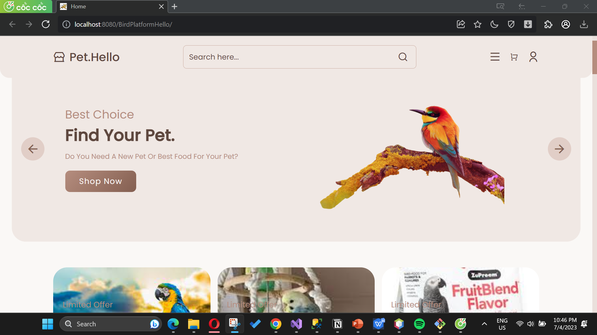
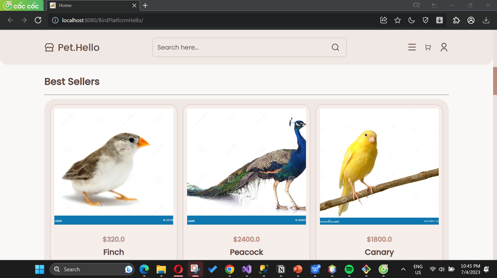
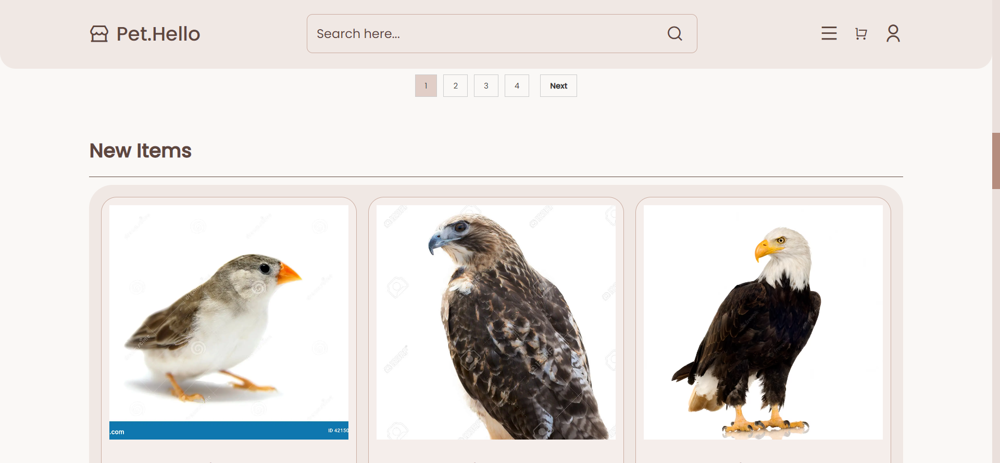
### Shop Home Page
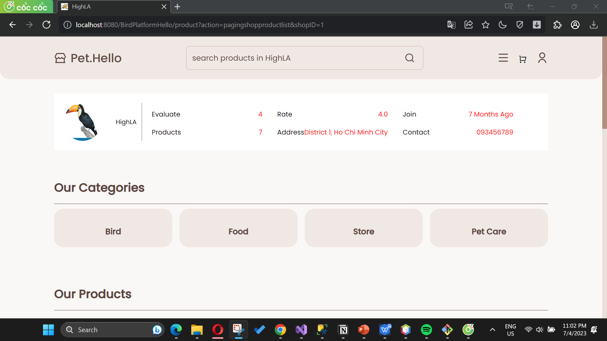
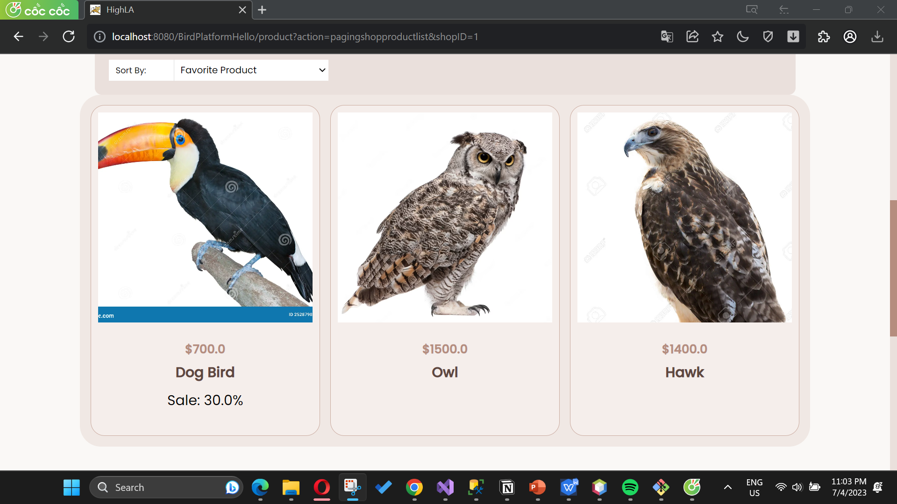
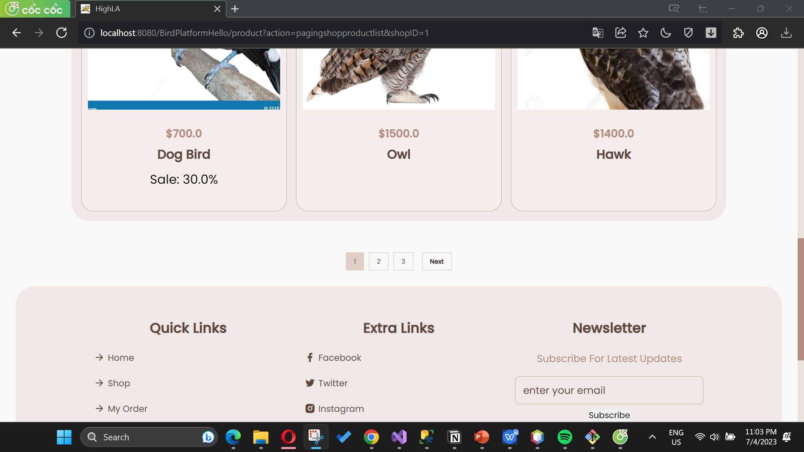
### Product Detail
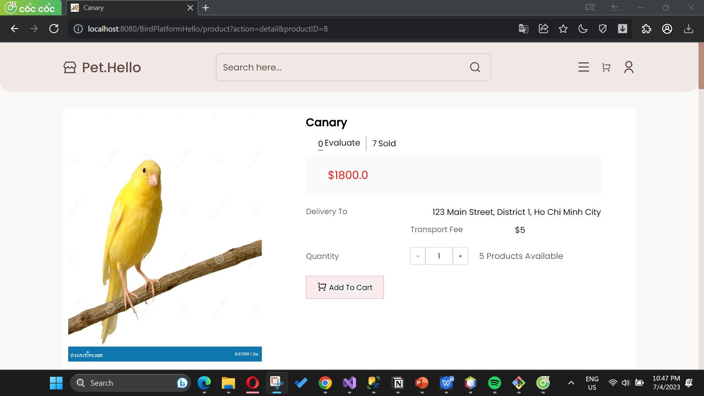
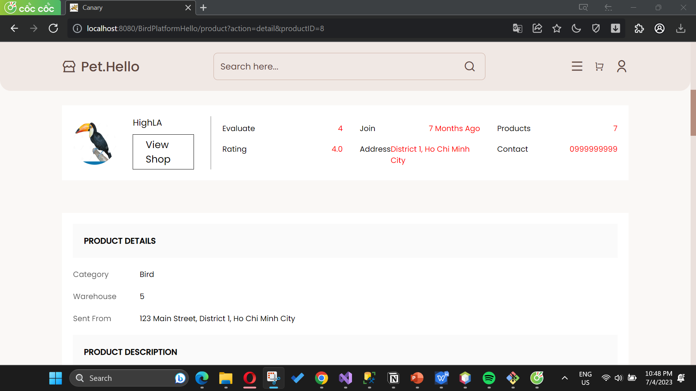
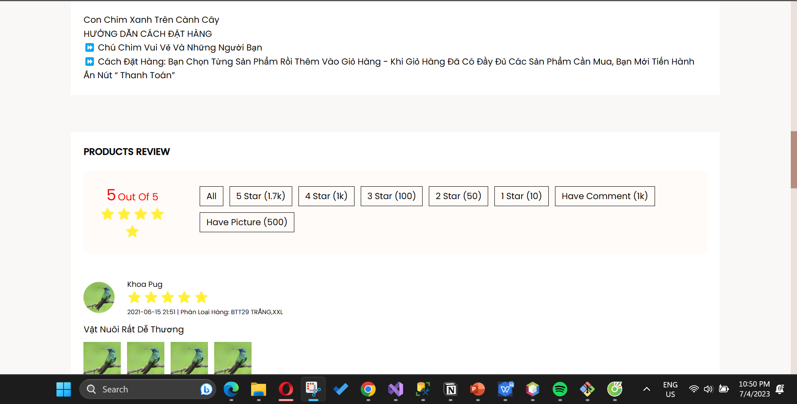
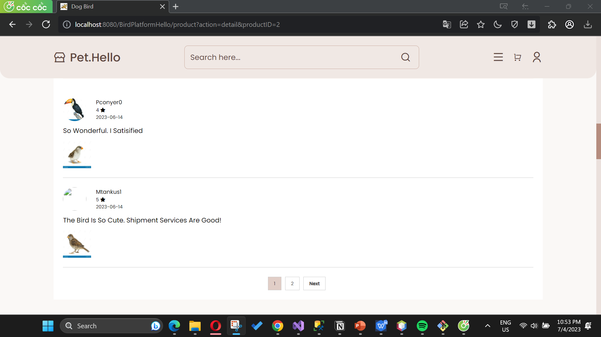
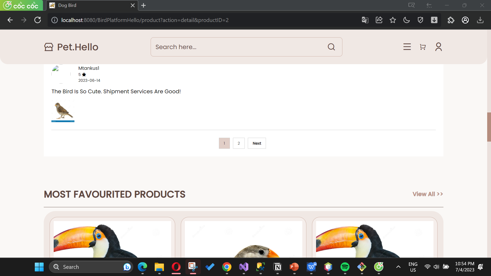
### Cart
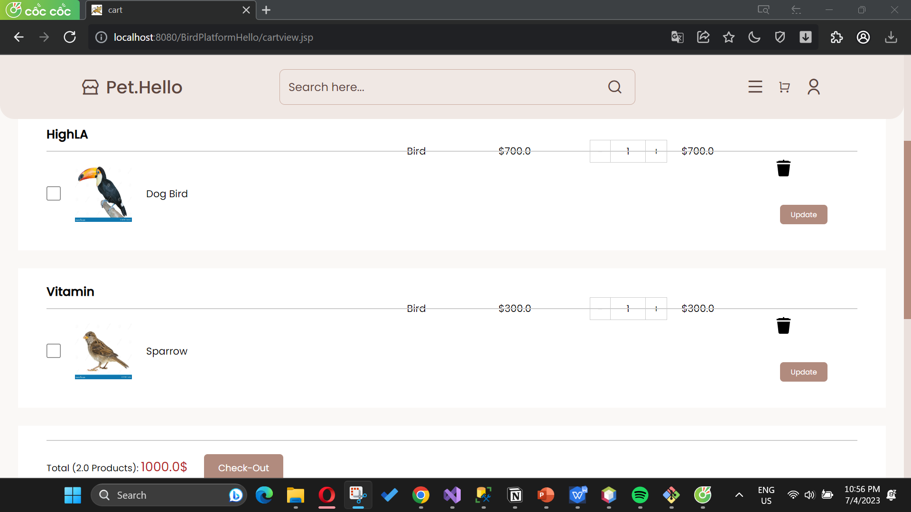
### Check out
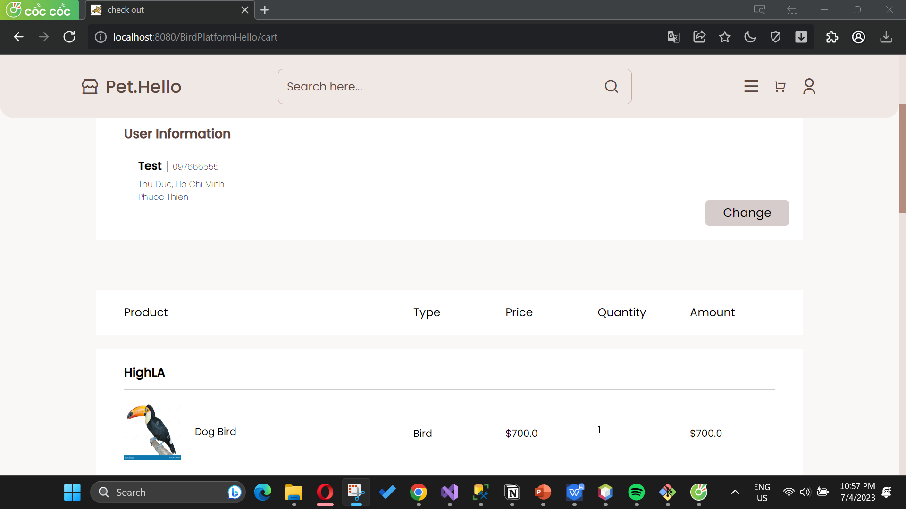
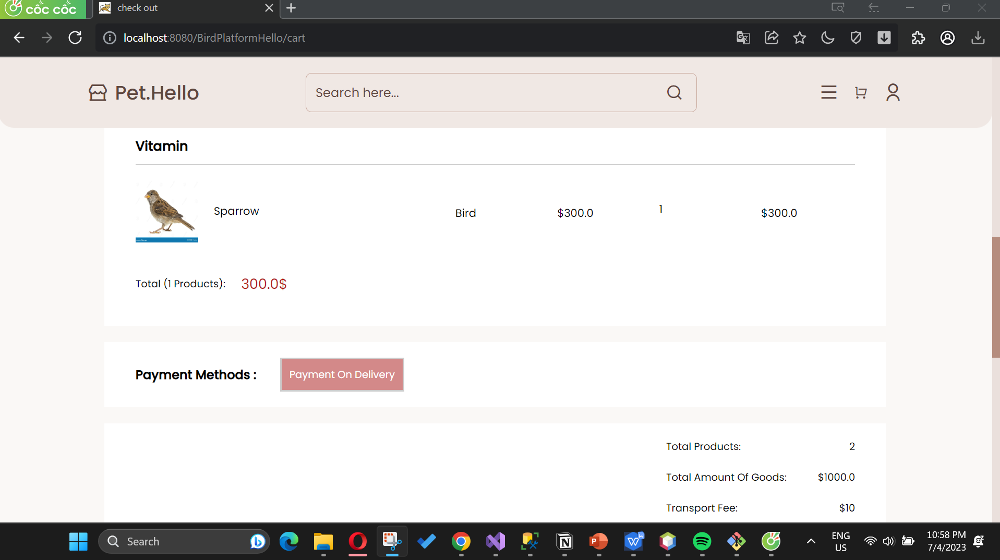
### Address Shipment
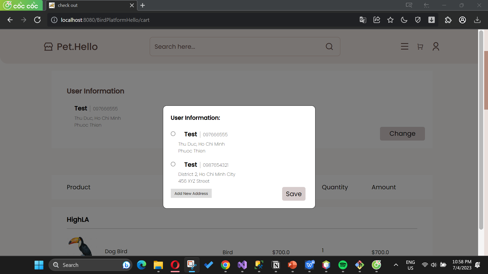
### Order
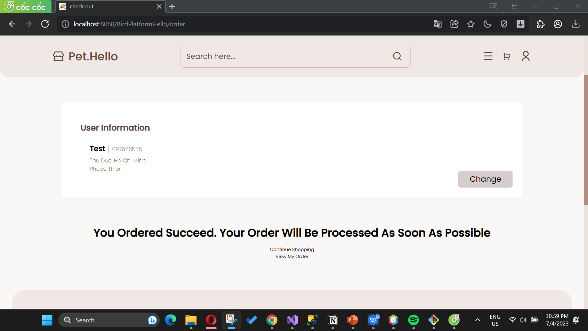
### Order History
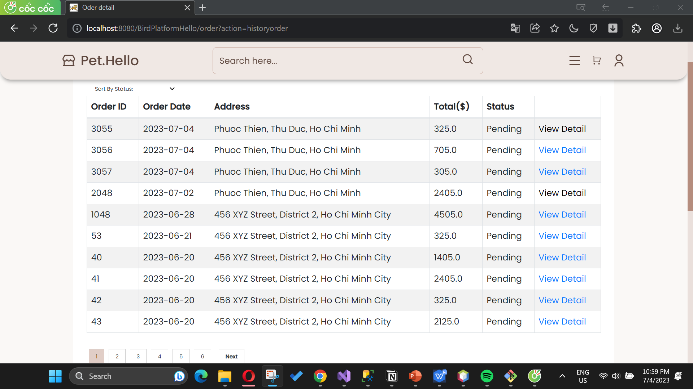
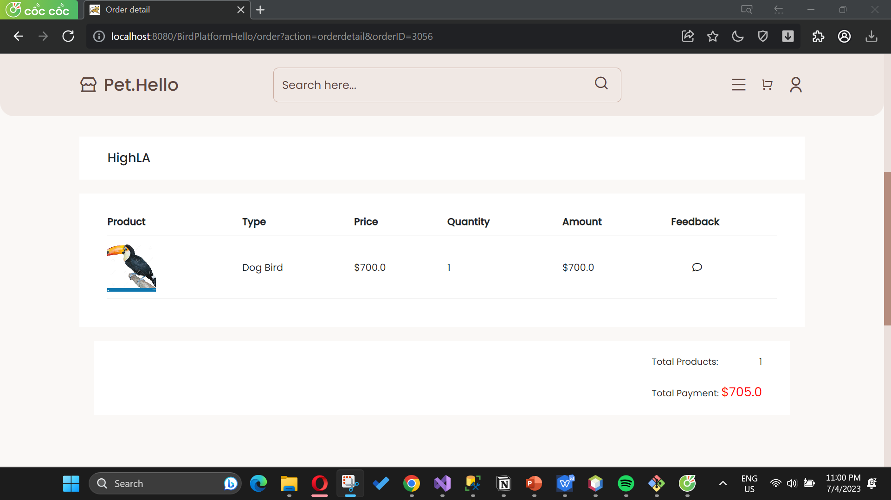
.png)

## Introduction:

The Capstone Project of the Bird Trading Platform aims to develop an innovative and user-friendly online platform specifically for bird enthusiasts and traders. The project addresses the need for a centralized and efficient marketplace for buying, selling and exchanging birds, accessories and related services. By leveraging technology and providing a transparent and secure environment, this platform will revolutionize the bird trade, making it more accessible, convenient and ethical.

## Background and reasons

The bird trade has been a popular activity among enthusiasts, breeders and collectors for decades. However, existing methods of bird trade often lack a standardized and regulated approach, leading to challenges regarding the reputation, trust and health of the birds involved. Traditional methods, such as physical auctions and classified ads, have limitations in terms of reach, transparency, and ease of use. There is an urgent need for a modern and ethical trading platform to ensure the welfare of birds while facilitating seamless transactions for buyers and sellers.

## Target

The main goal of the Capstone Project of the Bird Trading Platform is to design and develop a comprehensive online marketplace specifically for the bird trading community. The platform aims to achieve the following goals:

Provide a user-friendly interface: Design an intuitive and attractive platform that allows users to easily navigate, search for birds, and manage their listings.

Establish a secure transaction environment: Implement strong security measures to ensure the integrity and security of users' data and transactions, thereby promoting trust and confidence among users. traders.

Improve transparency and reliability: Implement a verification system for both buyers and sellers, ensuring that all users are legit and trustworthy. Additionally, provide a review and feedback system to promote transparency and facilitate informed decision making.

Promoting a Responsible Bird Trade: Incorporates tutorials and educational resources within the platform to raise awareness about legal and ethical practices in the bird trade. Encourage responsible ownership and discourage illegal activities such as smuggling and trade in endangered species.

## Limit

The scope of the Capstone Project Bird Trading Platform includes the design, development and implementation of the online platform. It includes creating a user interface, integrating a secure payment system, implementing search and filtering functions, developing a comprehensive database of birds, and setting up administrative tools to manage them. Manage user accounts and lists. The project will focus on providing a web-based platform accessible from a variety of devices, with the potential to expand to mobile applications in the future.

By successfully completing this important project, we aim to revolutionize the bird business by providing a reliable, ethical and user-friendly platform. The Bird Trading Platform will empower enthusiasts, breeders and traders, while protecting the welfare of birds and promoting responsible practices.
